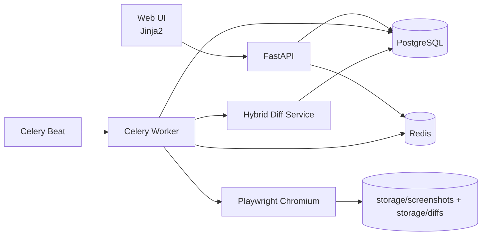

# PixelWatch

**PixelWatch** — production-like pet-проект на Python для мониторинга визуальных изменений сайтов.

Сервис по расписанию открывает страницу через Playwright, делает full-page скриншот, сравнивает с предыдущей версией и сохраняет историю результатов. Для более точного детекта используется **гибридный подход**: визуальный diff + DOM hash + текстовый diff.

## Что это демонстрирует в портфолио

- Проектирование backend-архитектуры (FastAPI + Celery + SQLAlchemy)
- Работа с асинхронными фоновыми задачами и расписанием
- Интеграция браузерной автоматизации (Playwright) в server-side workflow
- Хранение и обработка бинарных файлов (скриншоты и diff-артефакты)
- Практика миграций БД и эволюции схемы (Alembic)
- Практика API-дизайна, базового UI и тестирования MVP

## Ключевые возможности

- CRUD для мониторинга страниц
- Периодические проверки через Celery Beat (каждую минуту)
- Full-page скриншоты с поддержкой очень длинных страниц (тайловый fallback)
- Визуальный diff с подсветкой изменённых областей
- Гибридная метрика изменений:
  - визуальный процент
  - текстовый процент
  - изменение DOM
  - итоговый `hybrid_change_percent`
- Уведомления о значимых изменениях и ошибках проверки
- Веб-интерфейс на Jinja2 + CSS
- REST API для мониторов, скриншотов, diff и уведомлений

## Стек

- Python 3.12+
- FastAPI
- PostgreSQL
- SQLAlchemy 2.x
- Alembic
- Celery + Redis
- Playwright (Chromium)
- Pillow
- Jinja2
- Docker + Docker Compose
- pytest, ruff, black

## Скриншоты интерфейса

После добавления реальных изображений положите их в `docs/screenshots/`.

- `docs/screenshots/index.png` — список мониторов
- `docs/screenshots/monitor_detail.png` — карточка монитора
- `docs/screenshots/notifications.png` — уведомления

## Архитектура



## Как работает проверка

1. Beat запускает `check_all_active_monitors` каждую минуту.
2. Для активных мониторов проверяется интервал запуска.
3. Worker выполняет `check_page_monitor`.
4. Playwright открывает страницу и делает full-page скриншот.
5. Сервис извлекает дополнительные сигналы:
   - нормализованный DOM hash
   - нормализованный видимый текст
6. Выполняется сравнение с предыдущим успешным снимком.
7. Сохраняются:
   - Screenshot
   - VisualDiff
   - агрегированная метрика изменения
8. Если порог превышен, создаётся Notification.

## Структура проекта

```text
pixelwatch/
  app/
    api/routes/
    core/
    models/
    schemas/
    services/
    tasks/
    web/
      templates/
      static/
    main.py
  migrations/
  storage/
    screenshots/
    diffs/
  tests/
  Dockerfile
  docker-compose.yml
  pyproject.toml
  README.md
```

## Быстрый старт (Docker)

1. Подготовьте окружение:

```bash
cp .env.example .env
```

2. Запустите проект:

```bash
docker compose up --build
```

3. Откройте:

- Web UI: http://localhost:8000
- Swagger: http://localhost:8000/docs

## Команды разработки

Можно использовать `Makefile`:

```bash
make up           # поднять сервисы
make down         # остановить сервисы
make logs         # логи
make restart-web  # перезапуск web
make restart-workers # перезапуск worker + beat
make migrate      # alembic upgrade head
make lint         # ruff check
make test         # pytest
```

## Переменные окружения

```env
DATABASE_URL=postgresql+psycopg://pixelwatch:pixelwatch@db:5432/pixelwatch
REDIS_URL=redis://redis:6379/0
STORAGE_DIR=/app/storage
SCREENSHOT_TIMEOUT_SECONDS=30
VISUAL_DIFF_THRESHOLD=25
SIGNIFICANT_CHANGE_PERCENT=5
```

## Миграции

```bash
docker compose exec web alembic upgrade head
```

Создать новую миграцию:

```bash
docker compose exec web alembic revision -m "add something"
```

## REST API

### Мониторы

- `GET /api/monitors`
- `POST /api/monitors`
- `GET /api/monitors/{id}`
- `PATCH /api/monitors/{id}`
- `DELETE /api/monitors/{id}`
- `POST /api/monitors/{id}/check`

### Данные проверок

- `GET /api/monitors/{id}/screenshots`
- `GET /api/monitors/{id}/diffs`

### Уведомления

- `GET /api/notifications`
- `PATCH /api/notifications/{id}/read`

## Примеры запросов

Создать монитор:

```bash
curl -X POST http://localhost:8000/api/monitors \
  -H 'Content-Type: application/json' \
  -d '{
    "title": "Docs",
    "url": "https://example.com",
    "check_interval_minutes": 5,
    "is_active": true
  }'
```

Запустить проверку вручную:

```bash
curl -X POST http://localhost:8000/api/monitors/1/check
```

Получить diff-историю:

```bash
curl http://localhost:8000/api/monitors/1/diffs
```

## Качество и тесты

Локально:

```bash
pip install -e .[dev]
ruff check .
pytest -q
```

В CI запускаются:

- `ruff check .`
- `pytest -q`

## Поведение при ошибках

- Если страница недоступна:
  - создаётся `Screenshot` со статусом ошибки
  - сохраняется `error_message`
  - сравнение не выполняется
  - создаётся уведомление о проблеме
- Если это первый успешный снимок:
  - используется как baseline
  - `VisualDiff` не создаётся
  - `last_change_percent` остаётся `null`

## Ограничения MVP

- Нет авторизации и мульти-пользовательского режима
- Локальное файловое хранилище (без S3)
- Нет ignore-regions для динамических блоков

## Roadmap

- Telegram уведомления
- Email уведомления
- Авторизация и роли
- Проекты/команды
- Ignore regions
- Mobile/Desktop профили съемки
- Визуальная heatmap
- S3-compatible storage
- GitHub Actions release pipeline

## Для собеседования

Короткий сценарий демонстрации:

1. Создать монитор на страницу с часто обновляемым контентом.
2. Запустить ручную проверку.
3. Показать baseline screenshot.
4. Изменить страницу/выбрать другую ревизию.
5. Повторно запустить проверку и показать diff + уведомление.
6. Показать API в Swagger и фоновые логи worker/beat.

## Лицензия

MIT (см. файл `LICENSE`).

---

PixelWatch — pet-проект для портфолио, сфокусированный на backend-практиках production-like уровня.
